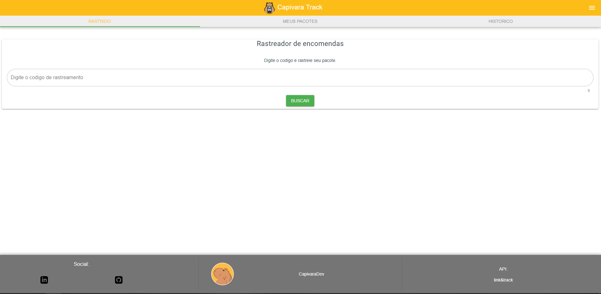
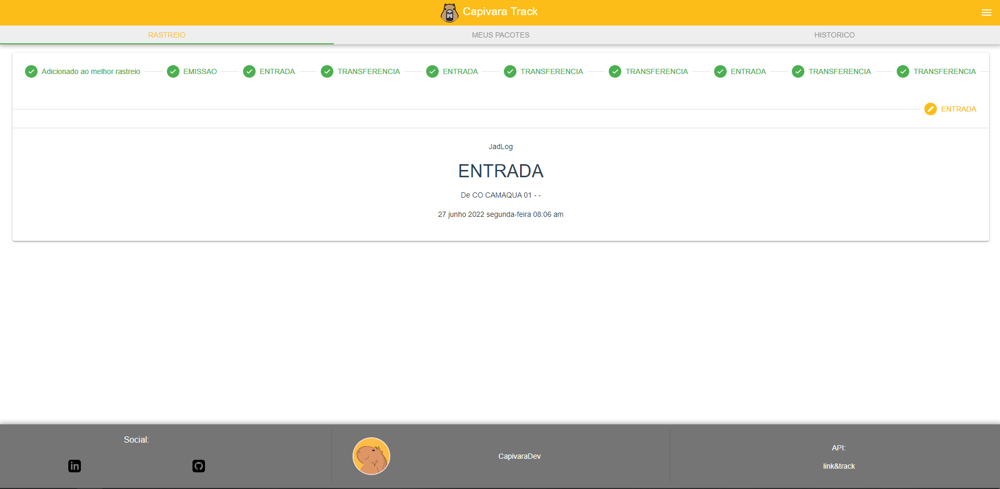

# Capivara Tracker (rastreamento de encomendas)
## V1.0 Busca pacotes dos correios
## V1.2 Busca pacotes dos correios e JadLog

## Personal Settings
App feito para buscar e monitorar encomendas dos correios atraves da ~~api Link e track~~ Melhor Envio de forma estudar alguns pontos de chamadas de apis e uso de tokens e tornar um PWA com atualização e mensagens push (em andamento)

# Home

# Tela de rastreio


## Git clone 
```
git clone https://github.com/leonardohuttner/capivara_tracker.git
```

## Instalaçao de dependencias
```
npm install
```

### Compila e serve a aplicaçao local
```
npm run serve
```

### Vercel
Deployed at vercel app
